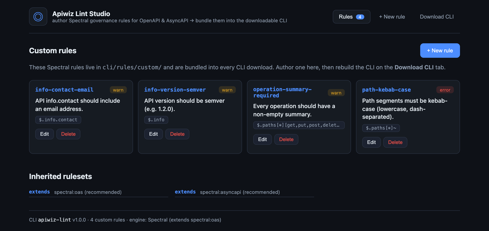
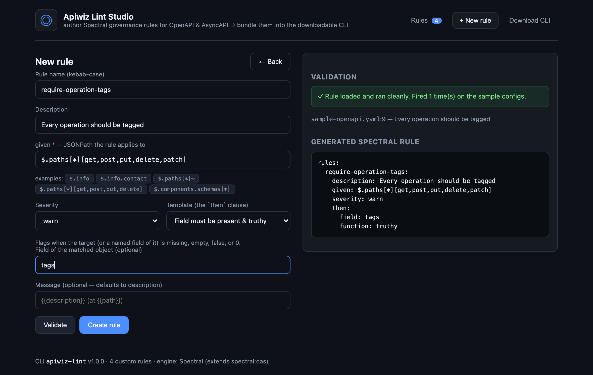

# Apiwiz Lint Studio

Author **custom [Spectral](https://github.com/stoplightio/spectral) governance rules** for
**OpenAPI & AsyncAPI** specs in a web UI, validate them against sample specs, and **bundle them into
a downloadable CLI** that anyone on your team can install via **npm** or **Docker** — on top of the
standard `spectral:oas` / `spectral:asyncapi` rulesets, with your org's rules baked in.

> **▶ Live UI demo:** https://sreenivas-sadhu-prabhakara.github.io/apiwiz-lint-studio/
> — a static, backend-free preview. Authoring and building need the backend, so clone the repo and
> run `npm start` for the real thing.

This is the same Rule Studio pattern as
[tetrate-lint-studio](https://github.com/Sreenivas-Sadhu-Prabhakara/tetrate-lint-studio) and
[apigee-lint-with-custom-rules-ui](https://github.com/Sreenivas-Sadhu-Prabhakara/apigee-lint-with-custom-rules-ui).
Here the engine is **Spectral** and the focus is **API-spec governance** (Apiwiz's domain).

## Screenshots

**Rule library** — custom governance rules, bundled into every CLI download on top of `spectral:oas`:



**Authoring + live validation** — pick a template, set a JSONPath `given`, validate against sample
OpenAPI/AsyncAPI specs (runs the *real* CLI), and review the generated Spectral rule:



## What's here

| Path | What it is |
| ---- | ---------- |
| `cli/` | `apiwiz-lint` — wraps `@stoplight/spectral-cli`, extends `spectral:oas`/`spectral:asyncapi`, and auto-applies a ruleset compiled from `rules/custom/*.json`. The downloadable artifact. |
| `server/` | Node/Express backend. Lists rules, generates + validates Spectral rules, writes them into `cli/rules/custom/`, and packs/builds the CLI. |
| `ui/` | React (Vite) Studio — browse rules, author new ones, build the download. Has a demo mode for static hosting. |
| `dist/` | Output: packed CLI tarballs. |
| `Dockerfile` | Builds a self-contained CLI image. |
| `docs/` | [Architecture](docs/architecture.md) · [Adding rules](docs/adding-rules.md) · [Downloading the CLI](docs/downloading-the-cli.md) |

## Quick start

```bash
npm run setup                      # install cli + server + ui

npm run dev:server                 # backend on http://localhost:4800
npm run dev:ui                     # UI on http://localhost:5800 (proxies API)
# or:
npm start                          # build UI + serve everything on http://localhost:4800
```

Create a rule, then **Download CLI → Build new download** — the tarball in `dist/` contains your rule.

## The core idea

Spectral already ships excellent OpenAPI/AsyncAPI rulesets and supports custom rules. The studio adds
a **UI to author org-specific rules** (guided templates → `given`/`then`/`severity`) and a **CLI
wrapper that bundles them — on top of the standard rulesets — and applies everything by default**, so
a downloaded CLI just *has* your governance baked in. Opt out per-run with `--no-bundled-rules`.

## Attribution

`cli/` wraps [stoplightio/spectral](https://github.com/stoplightio/spectral) (Apache-2.0), installed
as a dependency. This project is MIT licensed.
